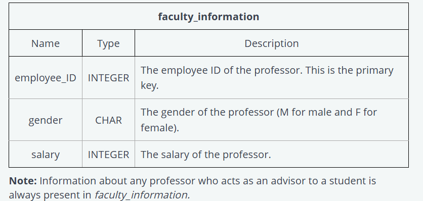
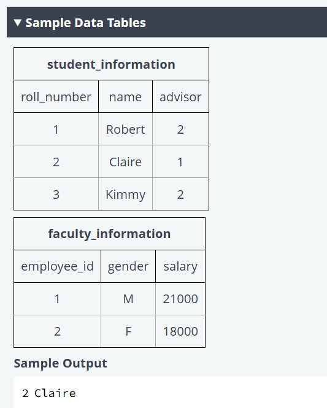

-----------------------------
SELECT std.roll_number, std.name from student_information as std, faculty_information as fi
where std.advisor = fi.employee_id and (fi.gender = 'M' AND salary > 15000 or fi.gender = 'F' AND salary > 20000)
------------------------------
